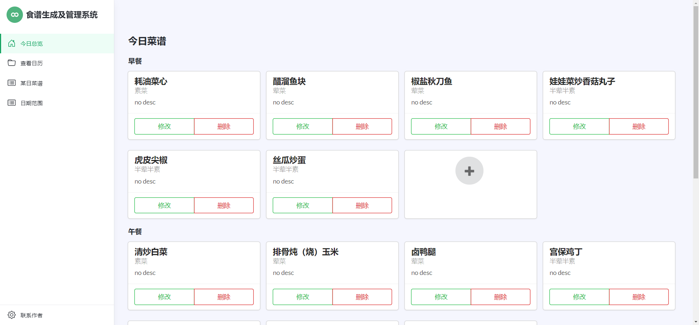
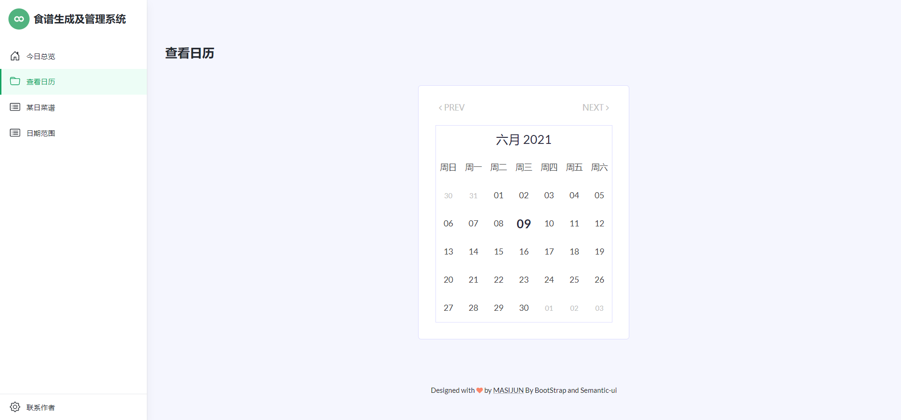
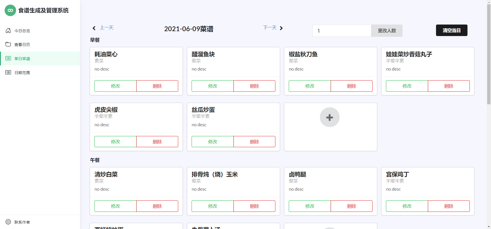
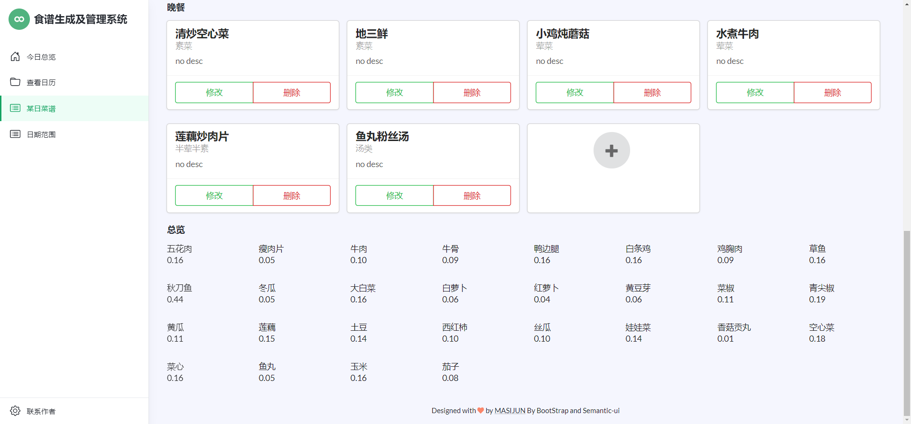
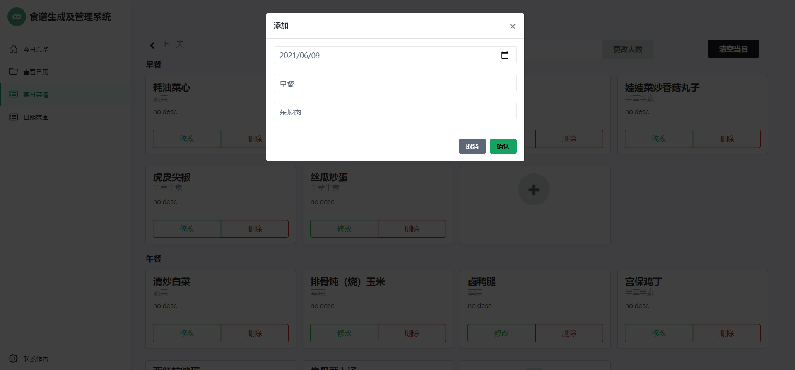
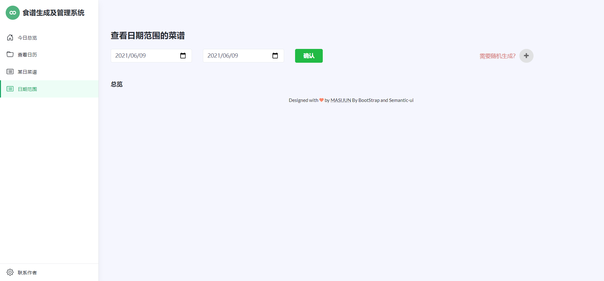
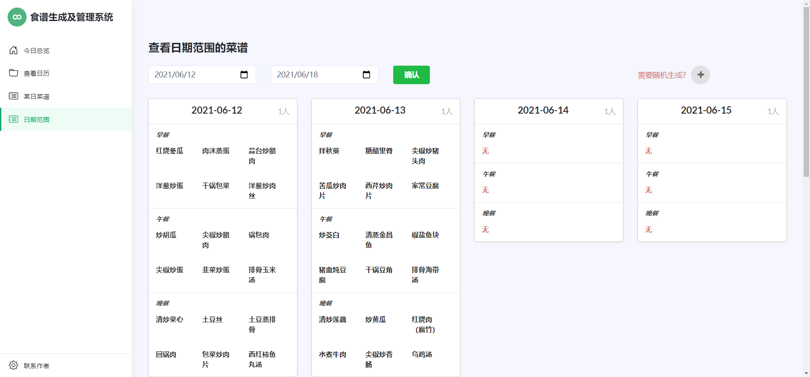
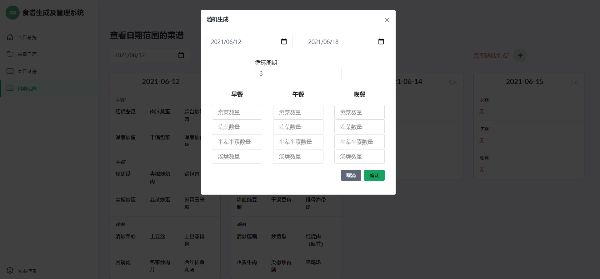

# 项目背景

单位食堂制定菜谱要求三四天内不得重复，一次就要定一周的菜，
单位指定食谱是个很头疼的大事，领导还想搞信息化，就把我拉上了。

# 预期功能
1. 可以查看每日的菜谱
2. 能按照上报格式上报当日食谱
3. 可以方便自动生成随机的菜谱
4. 可以自动计算食材的总量
5. 食谱管理的基本功能（增删改）

# 项目简介

这是一个用来食堂管理菜谱的小系统，通过Python导入菜品信息，Spring来操作数据库。

由于是本地项目，而且属于轻量级项目，为了避免和单位内部电脑各种（傻逼）
“管理系统”冲突， 选择用Sqlite3作为本地轻量级数据库。

项目由SpringBoot来实现，主要传输数据的方式还是依靠model，没实现前后分离，
这也是遗憾之一。

## 首页



## 日历功能



## 菜谱管理

### 菜谱管理



### 食材明细



### 添加菜



## 查看日期范围

### 未查看时



### 查看时



### 随机生成



# 技术栈

1. Java
2. Spring Boot
3. BootStrap及Semantic UI
4. Thymeleaf
5. mybatis
6. Python-Sqlite3

在这里，我没有用上身份验证，因为都是内网系统，所以就不做验证了
如果要做验证可以加上拦截器或者SpringSecurity。

本想着试试Ajax和Json传输数据，发现我对Vue的确是一点也不熟悉，后期改。

# 项目结构
src目录下结构如下
```text
├─main
│  ├─java
│  │  └─com
│  │      └─example
│  │          ├─console
│  │          ├─controller
│  │          ├─mapper
│  │          ├─pojo
│  │          ├─service
│  │          └─utils
│  └─resources
│      ├─mybatis
│      │  └─mapper
│      ├─static
│      │  ├─css
│      │  ├─images
│      │  ├─js
│      │  ├─plugins
│      │  ├─scss
│      │  ├─semantic
│      │  └─vendor
│      └─templates
│          ├─commons
│          └─error
└─test
└─java
└─com
└─example
```

static文件夹我就不介绍了，因为我不是很会前端，这个管理的比较混乱。

主要介绍下Spring文件夹的内容。

console存放了一个console.sql，你们可以不用自己写了，我就连数据库都给你们放进去了

controller文件夹存放各种控制器，
目前约定好有ViewController（控制简单的页面跳转的控制器），
DailyController（菜谱中信息的操作控制器，仅操作数据库，然后返回到ViewController），

mapper文件夹存放mybatis的mapper接口，
不需要太详细介绍，就是那些东西而已

pojo存放实体类及一些静态变量。

service存放包装好的mapper接口，中间涉及到Date的类型转换

utils存放一些工具类，比如日期的计算等


